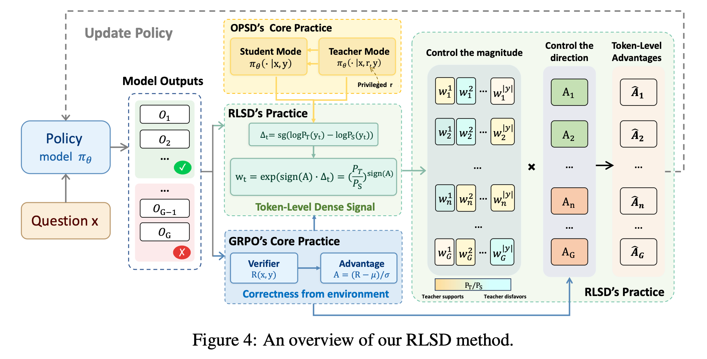
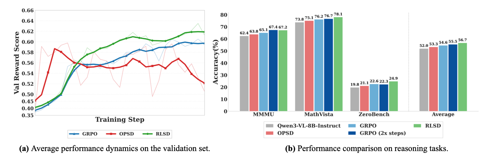

# Self-Distilled RLVR (RLSD)

[Chinese](README_zh.md)

## Method

RLSD (Self-Distilled RLVR) reframes self-distillation from a distribution-matching objective into a token-level credit assignment signal for RLVR. The teacher model can use privileged information, but that information does not directly decide which tokens should be reinforced or penalized, nor does it change the direction of parameter updates. It only adjusts how much credit each token receives within the same trajectory.

Given a student-sampled trajectory $y=(y_1,\dots,y_T)$, RLSD computes the log-probability of each token under both the student context $x$ and the teacher context $(x,r)$, then defines the privileged information gain:

$$
\Delta_t=\texttt{sg}\left(\log P_T(y_t)-\log P_S(y_t)\right)
$$

where $\texttt{sg}$ denotes stop-gradient. $\Delta_t$ measures the marginal contribution of the privileged information $r$ to the current token: a positive value means the teacher-side information supports the token more, while a negative value means it does not support the token. Because $\Delta_t$ is stop-gradient, it is used only as a weighting signal and does not introduce an additional optimization path.

RLSD then constructs a direction-aware evidence weight according to the sign of the sequence-level advantage:

$$
w_t=\exp(\mathrm{sign}(A)\cdot\Delta_t)=\left(\frac{P_T(y_t)}{P_S(y_t)}\right)^{\mathrm{sign}(A)}
$$

When $A>0$, tokens more supported by the teacher receive larger positive credit. When $A<0$, the weight is inverted so that tokens less supported by the teacher receive larger blame. Since $w_t$ is always positive, RLSD never flips the sign of the advantage: the environment reward still decides whether the whole trajectory is reinforced or penalized, while the teacher only redistributes credit inside the trajectory.

Finally, RLSD clips the evidence weight to limit the influence of any single token during training:

$$
\hat{A}_t=A\cdot\mathrm{clip}(w_t,1-\epsilon_w,1+\epsilon_w)
$$

This design is analogous to the clipped surrogate objective in PPO/GRPO. GRPO clips the policy ratio to constrain the update step size, while RLSD clips the evidence ratio to constrain the magnitude of credit redistribution. This allows RLSD to use teacher-side information while preserving stable training.



## Performance



| Method | MMMU | MathVista | MathVision | ZeroBench | Wemath | Avg. |
|--------|-----:|----------:|-----------:|----------:|-------:|-----:|
| Base LLM | 62.44 | 73.80 | 47.37 | 19.76 | 54.10 | 51.49 |
| GRPO | 65.11 | 76.20 | 48.82 | 22.60 | 56.57 | 53.86 |
| OPSD | 63.82 | 75.10 | 47.53 | 21.06 | 54.95 | 52.49 |
| SDPO | 65.11 | 74.00 | 47.27 | **25.15** | 52.19 | 52.74 |
| GRPO+OPSD | 63.22 | 75.90 | 48.52 | 22.16 | 54.76 | 52.91 |
| **RLSD** *(Ours)* | **67.22** | **78.10** | **52.73** | 24.85 | **58.00** | **56.18** |

## Installation

This project depends on the environment from [EasyVideoR1: Easier RL for Video Understanding](https://github.com/cyuQ1n/EasyVideoR1). Please first create the base environment following EasyVideoR1, then install this project in the same environment.

### Step 1: Create a Conda Environment

```bash
conda create -n rlsd python=3.11
conda activate rlsd
```

### Step 2: Install the EasyVideoR1 Base Environment

```bash
git clone https://github.com/cyuQ1n/EasyVideoR1.git
cd EasyVideoR1
pip install -e .
pip install flash-attn==2.8.3 --no-build-isolation
```

### Step 3: Install This Project

```bash
git clone <this-repo-url>
cd rlsd_verl
pip install -e .
```

If you already have this repository locally, install it directly from the current project directory:

```bash
cd /pfs/qcy/video_rl/rlsd_verl
pip install -e .
```

### Dependencies

This project follows EasyVideoR1's veRL, Ray, vLLM, and Qwen-VL dependencies, and maintains additional dependencies in this repository's `requirements.txt`. Key versions include:

```text
qwen-vl-utils[decord]==0.0.14
transformers==4.57.3
vllm==0.11.0
flash-attn==2.8.3
```

## Quick Start

The minimal training workflow is as follows.

### Step 1: Prepare Data

The training and validation data can be downloaded from the Hugging Face dataset [iieycx/rlsd-train-MMFineReason-123K](https://huggingface.co/datasets/iieycx/rlsd-train-MMFineReason-123K).

The training data should be in JSON/JSONL format. Each example should contain at least the question, answer, and image fields.

### Step 2: Use the Provided Configs and Scripts

This repository provides ready-to-use RLSD and GRPO baseline configuration files and training scripts under `examples/visual_rl/`:

| Method | Config File | Training Script |
|--------|-------------|-----------------|
| RLSD | `examples/visual_rl/rlsd_config.yaml` | `examples/visual_rl/rlsd_train.sh` |
| GRPO Baseline | `examples/visual_rl/grpo_baseline_config.yaml` | `examples/visual_rl/grpo_baseline_train_MMFineReason.sh` |

The training scripts already bind the corresponding YAML config, prompt template, and reward function. Default data paths, model paths, and output paths can be checked in the scripts, and can also be overridden with environment variables.

### Step 3: Start Training

Run RLSD:

```bash
bash examples/visual_rl/rlsd_train.sh
```

Run the GRPO baseline:

```bash
bash examples/visual_rl/grpo_baseline_train_MMFineReason.sh
```

For multi-node training, set `WORLD_SIZE`, `RANK`, and `MASTER_ADDR` on each node, then run the corresponding script:

```bash
# RLSD head node
WORLD_SIZE=2 RANK=0 MASTER_ADDR=<head_node_ip> bash examples/visual_rl/rlsd_train.sh

# RLSD worker node
WORLD_SIZE=2 RANK=1 MASTER_ADDR=<head_node_ip> bash examples/visual_rl/rlsd_train.sh
```

## Project Structure

```text
rlsd_verl/
|-- verl/                       # Core RL training framework
|   |-- trainer/                # GRPO / OPSD / RLSD training entry points and loops
|   |-- workers/                # Actor, rollout, reward, and critic workers
|   |-- models/                 # Qwen-VL model adaptation
|   `-- utils/                  # Dataset, tokenizer, FSDP, logging, and checkpoint utilities
|-- examples/
|   `-- visual_rl/              # Visual RL configs, training scripts, prompts, and rewards
|-- requirements.txt            # Python dependencies
|-- setup.py                    # Editable installation entry point
`-- README_zh.md
```

## Example Pipelines

### RLSD (`examples/visual_rl/`)

The RLSD training script uses `verl.trainer.opsd_main` by default, and handles rewards for different visual reasoning tasks through `examples/visual_rl/reward_function/unified.py`.

```bash
bash examples/visual_rl/rlsd_train.sh
```

### GRPO Baseline (`examples/visual_rl/`)

The standard GRPO baseline uses the same data, prompt, and reward interfaces, making it convenient to compare against RLSD.

```bash
bash examples/visual_rl/grpo_baseline_train_MMFineReason.sh
```

## Acknowledgements

This project is built on the following work:

- [EasyVideoR1](https://github.com/cyuQ1n/EasyVideoR1) - Easier RL for Video Understanding
- [EasyR1](https://github.com/hiyouga/EasyR1) - An efficient and scalable multimodal RL training framework
- [veRL](https://github.com/volcengine/verl) - High-performance RL and HybridEngine

## Citation

If you use this project, please cite Self-Distilled RLVR, EasyVideoR1, EasyR1, and veRL:

```bibtex
@misc{yang2026selfdistilledrlvr,
      title={Self-Distilled RLVR},
      author={Chenxu Yang and Chuanyu Qin and Qingyi Si and Minghui Chen and Naibin Gu and Dingyu Yao and Zheng Lin and Weiping Wang and Jiaqi Wang and Nan Duan},
      year={2026},
      eprint={2604.03128},
      archivePrefix={arXiv},
      primaryClass={cs.LG},
      url={https://arxiv.org/abs/2604.03128},
}

@misc{qin2026easyvideor1easierrlvideo,
      title={EasyVideoR1: Easier RL for Video Understanding},
      author={Chuanyu Qin and Chenxu Yang and Qingyi Si and Naibin Gu and Dingyu Yao and Zheng Lin and Peng Fu and Nan Duan and Jiaqi Wang},
      year={2026},
      eprint={2604.16893},
      archivePrefix={arXiv},
      primaryClass={cs.CV},
      url={https://arxiv.org/abs/2604.16893},
}

```

## License

This project follows the same license as [EasyR1](https://github.com/hiyouga/EasyR1).

## Self-Taught RLVR

This series is built around one core question:

> How can large models guide themselves and evolve iteratively?

The Self-Taught line explores three complementary dimensions:

- The first work, **RLSD**, studies the **informed self**: the model teaches itself with privileged information.
- The second work, **NPO**, focuses on the **temporal self**: the model is taught by its near-future self.
- The third work, **CoPD**, explores the **parallel self**: the model is taught by another version of itself that takes a different path.

These three works address key questions in RLVR and OPD:

- **RLSD**: How can a model better absorb useful privileged information?
- **NPO**: How can RLVR introduce more suitable auxiliary learning signals?
- **CoPD**: How can a single model better absorb the capabilities of multiple experts?

All of these questions share the same underlying theme: how to introduce better learning signals and make them effectively absorbable by the model.

The Self-Taught RLVR series gives the same answer:

> Let the model provide itself with learning signals that match its current capability and are easier to absorb.

Welcome to upvote these works on Hugging Face:

- Hugging Face: https://huggingface.co/papers/2604.03128
- Hugging Face: https://huggingface.co/papers/2604.20733
- Hugging Face: https://huggingface.co/papers/2604.27083

## WeChat Group


